<div align="center">


### 🚀 Passionate Front-End Developer | Building Digital Experiences


<p>
  
  
  
</p>

[](https://git.io/typing-svg)

[](https://linkedin.com/in/sohaib-joma)
[](mailto:sohaibjoma@gmail.com)
[](https://wa.me/201276527366)
[](https://github.com/sohaibjoma)

</div>


##  About Me

```javascript
const sohaib = {
    location: "📍 Damietta, Egypt 🇪🇬",
    role: "💼 Front-End Developer",
    currentFocus: ["Shopify Development", "Next.js Applications", "Full-Stack Solutions"],
    activeProject: "🏠 onas-home - Real Estate Platform",
    availability: "✅ Open to exciting collaborations and opportunities",
    
    expertise: {
        languages: ["JavaScript", "TypeScript", "Python", "C++"],
        specialties: ["React Ecosystem", "Vue.js", "Responsive Design", "Performance Optimization"],
        interests: ["Clean Architecture", "UI/UX Design", "Web Accessibility", "Modern CSS"]
    },
    
    technologies: {
        frontend: {
            frameworks: ["React", "Next.js", "Vue.js", "Nuxt.js"],
            styling: ["Tailwind CSS", "SASS", "Bootstrap", "Vuetify"],
            state: ["Redux", "Vuex", "Context API"]
        },
        backend: {
            runtime: ["Node.js", "Express"],
            databases: ["MongoDB", "Firebase"],
            apis: ["REST", "GraphQL"]
        },
        tools: ["Git", "Webpack", "Babel", "Jest", "Figma", "Postman", "Linux"]
    },
    
    achievements: [
        "🎯 Built scalable web applications serving thousands of users",
        "⚡ Optimized performance resulting in 40% faster load times",
        "🎨 Crafted pixel-perfect interfaces with 99% design accuracy",
        "🏆 Delivered 20+ successful client projects on time"
    ],
    
    lifePhilosophy: "Building the web, one component at a time! 🚀",
    funFact: "I develop without a keyboard yet! ⌨️😅",
    
    currentlyLearning: ["Advanced TypeScript", "Web3", "System Design"],
    askMeAbout: ["React", "Vue", "Next.js", "UI/UX", "Shopify", "Web Performance"]
};
```


##  Tech Stack & Tools

<div align="center">

### 🎨 Frontend Development


### 🎯 Styling & UI Frameworks


### ⚙️ Backend & Database


### 🛠️ Development Tools


### 💻 Programming Languages


</div>


##  GitHub Statistics

<div align="center">
  

  


</div>

<div align="center">
  

  


</div>

<div align="center">
  
</div>


##  Featured Projects

<div align="center">
  <a href="https://github.com/sohaibjoma/onas-home">
    
  </a>
</div>

### 🏠 [Onas Home](https://github.com/sohaibjoma/onas-home)
> A modern, responsive real estate platform delivering seamless property browsing experiences with cutting-edge technology

<div align="center">

**Built With:** `React` • `Next.js` • `Tailwind CSS` • `TypeScript`

</div>

**✨ Key Features:**
- 🎯 **Dynamic Listings** - Real-time property updates with instant data synchronization
- 🔍 **Smart Search** - Intelligent filtering system with multiple parameters
- 📱 **Mobile-First** - Fully responsive design optimized for all devices
- ⚡ **Lightning Fast** - Server-side rendering with Next.js for optimal performance
- 🎨 **Modern UI/UX** - Smooth animations and intuitive user interface
- 🔒 **Secure & Reliable** - Enterprise-grade authentication and data protection
- 🗺️ **Interactive Maps** - Location-based property visualization
- 💾 **Saved Searches** - Personalized user experience with saved preferences

<p align="center">
  <i>🚀 Building more innovative projects... Stay tuned!</i>
</p>


## 📈 Current Learning Journey

<div align="center">

<table>
  <tr>
    <td align="center" width="200">
      
      <br><strong>TypeScript</strong>
      <br><sub>Advanced Patterns & Generics</sub>
    </td>
    <td align="center" width="200">
      
      <br><strong>Next.js 14+</strong>
      <br><sub>Server Components & Actions</sub>
    </td>
    <td align="center" width="200">
      
      <br><strong>React Advanced</strong>
      <br><sub>Performance & Optimization</sub>
    </td>
    <td align="center" width="200">
      
      <br><strong>Web Security</strong>
      <br><sub>Best Practices & OWASP</sub>
    </td>
  </tr>
</table>

</div>


## 💡 What I'm Working On

```mermaid
graph LR
    A[🎯 Current Focus] --> B[Onas Home Platform]
    A --> C[Shopify Development]
    A --> D[Full-Stack Learning]
    B --> E[✨ Feature Development]
    B --> H[🎨 UI/UX Enhancement]
    C --> F[🛒 E-commerce Solutions]
    C --> I[⚙️ Custom Apps]
    D --> G[🔧 Backend Integration]
    D --> J[📊 Database Design]
    
    style A fill:#00b3ff,stroke:#fff,stroke-width:2px,color:#fff
    style B fill:#0d1117,stroke:#00b3ff,stroke-width:2px,color:#00b3ff
    style C fill:#0d1117,stroke:#00b3ff,stroke-width:2px,color:#00b3ff
    style D fill:#0d1117,stroke:#00b3ff,stroke-width:2px,color:#00b3ff
```

<div align="center">



</div>


## 🤝 Let's Connect & Collaborate!

<p align="center">
  
</p>

<p align="center">
  <i>💬 I'm always excited to connect with fellow developers, discuss new technologies,<br>and collaborate on innovative projects that make a difference!</i>
</p>

<div align="center">
  
### 📫 Reach Out To Me

<p>
  <a href="https://linkedin.com/in/sohaib-joma">
    
  </a>
  <a href="mailto:sohaibjoma@gmail.com">
    
  </a>
  <a href="https://wa.me/201276527366">
    
  </a>
  <a href="https://github.com/sohaibjoma">
    
  </a>
</p>

### 🌟 Open To:

<table>
  <tr>
    <td align="center">
      
      <br><b>Freelance Projects</b>
    </td>
    <td align="center">
      
      <br><b>Full-time Roles</b>
    </td>
    <td align="center">
      
      <br><b>Collaborations</b>
    </td>
    <td align="center">
      
      <br><b>Open Source</b>
    </td>
  </tr>
</table>

### ⚡ Quick Response Time
<p>
  
</p>

</div>


<div align="center">

###  Show some ❤️ by starring repositories you find interesting!

### 📊 Profile Summary


---


<p>
  
  
  
</p>

### 💖 Thank you for visiting my profile!

<p>
  
</p>

⭐️ **Crafted with passion by [Sohaib Joma](https://github.com/sohaibjoma)** ⭐️

</div>
