<div align="center">


### 🚀 Passionate Front-End Developer | Building Digital Experiences


<p align="center">
  
  
  
</p>

<p align="center">
  
</p>

<div align="center">
  
[](https://linkedin.com/in/sohaib-joma)
[](mailto:sohaibjoma@gmail.com)
[](https://wa.me/201276527366)
[](https://github.com/sohaibjoma)

</div>

</div>


<div align="center">

##  About Me

</div>

```javascript
const sohaibJoma = {
    // 🌍 Location & Identity
    location: "📍 Damietta, Egypt 🇪🇬",
    role: "💼 Front-End Developer",
    tagline: "Building the web, one pixel at a time! ✨",
    
    // 🎯 Current Status
    currentFocus: [
        "🛒 Shopify Development & Custom Apps",
        "⚡ Next.js 14+ Applications",
        "🔧 Full-Stack Solutions"
    ],
    activeProject: "🏠 onas-home - Real Estate Platform",
    availability: "✅ Open for Freelance & Full-time Opportunities",
    
    // 💪 Technical Arsenal
    expertise: {
        languages: ["JavaScript", "TypeScript", "Python", "C++"],
        specialties: [
            "⚛️  React Ecosystem & Architecture",
            "🎨 Modern UI/UX Design",
            "🚀 Performance Optimization",
            "📱 Responsive Web Design",
            "♿ Web Accessibility (a11y)"
        ],
        interests: [
            "Clean Code Architecture",
            "Design Systems",
            "Web3 Technologies",
            "Developer Experience"
        ]
    },
    
    // 🛠️ Technology Stack
    technologies: {
        frontend: {
            core: ["React", "Next.js", "Vue.js", "Nuxt.js"],
            styling: ["Tailwind CSS", "SASS/SCSS", "Bootstrap", "Vuetify", "Material-UI"],
            state: ["Redux Toolkit", "Vuex", "Context API", "Zustand"]
        },
        backend: {
            runtime: ["Node.js", "Express.js"],
            databases: ["MongoDB", "Firebase", "Firestore"],
            apis: ["REST", "GraphQL"]
        },
        tools: [
            "Git & GitHub",
            "VS Code",
            "Webpack & Vite",
            "Babel",
            "Jest & Testing Library",
            "Figma & Adobe XD",
            "Postman",
            "Linux/Unix"
        ]
    },
    
    // 🏆 Achievements
    achievements: [
        "🎯 Built scalable web applications serving 10,000+ users",
        "⚡ Achieved 40% performance improvement through optimization",
        "🎨 Delivered pixel-perfect interfaces with 99% design accuracy",
        "🏆 Completed 20+ successful client projects",
        "📚 Mentored junior developers in modern web technologies"
    ],
    
    // 🎓 Learning Path
    currentlyLearning: [
        "Advanced TypeScript Patterns",
        "Web3 & Blockchain Development",
        "System Design & Architecture",
        "Cloud Technologies (AWS/Azure)"
    ],
    
    // 💬 Ask Me About
    askMeAbout: [
        "React & Next.js",
        "Vue.js & Nuxt.js",
        "Shopify Development",
        "UI/UX Best Practices",
        "Web Performance",
        "Frontend Architecture"
    ],
    
    // 🎭 Fun Facts
    funFacts: [
        "☕ Powered by coffee and clean code",
        "⌨️  Still developing without a full keyboard!",
        "🎮 Gaming + Coding = Perfect Balance",
        "🌙 Night owl developer 🦉"
    ],
    
    // 💭 Philosophy
    motto: "Code with passion, design with purpose, deploy with confidence! 🚀"
};

console.log("Welcome to my GitHub! Let's build something amazing together! 🌟");
```


<div align="center">

##  Technology Stack

</div>

<div align="center">

### 🎨 Frontend Development
<p>
  
</p>

### 💅 Styling & UI Frameworks
<p>
  
</p>

### ⚙️ Backend & Database
<p>
  
</p>

### 🛠️ Development Tools & Platforms
<p>
  
</p>

### 💻 Programming Languages
<p>
  
</p>

</div>


<div align="center">

##  GitHub Analytics

</div>

<div align="center">
<table>
  <tr>
    <td width="50%" align="center">
      
    </td>
    <td width="50%" align="center">
      
    </td>
  </tr>
</table>
</div>

<div align="center">
<table>
  <tr>
    <td width="50%" align="center">
      
    </td>
    <td width="50%" align="center">
      
    </td>
  </tr>
</table>
</div>

<div align="center">
  
</div>

<div align="center">
  
</div>


<div align="center">

##  Featured Projects

</div>

<div align="center">

### 🏠 [Onas Home - Real Estate Platform](https://github.com/sohaibjoma/onas-home)

<a href="https://github.com/sohaibjoma/onas-home">
  
</a>

<p align="center">
  <i>✨ A cutting-edge real estate platform revolutionizing property browsing with modern web technologies ✨</i>
</p>

<p align="center">
  
  
  
  
</p>

</div>

<table align="center">
  <tr>
    <td valign="top" width="50%">
      
#### ✨ Core Features
- 🎯 **Dynamic Listings** - Real-time property updates
- 🔍 **Smart Search** - Advanced filtering system
- 📱 **Mobile-First** - Responsive across all devices
- ⚡ **Lightning Fast** - Optimized SSR with Next.js
      
    </td>
    <td valign="top" width="50%">
      
#### 🚀 Advanced Capabilities
- 🎨 **Modern UI/UX** - Smooth animations
- 🔒 **Secure & Reliable** - Enterprise-grade auth
- 🗺️ **Interactive Maps** - Location visualization
- 💾 **Personalization** - Saved searches & preferences
      
    </td>
  </tr>
</table>

<p align="center">
  
</p>


<div align="center">

## 📚 Current Learning Journey

</div>

<div align="center">

<table>
  <tr>
    <td align="center" width="25%">
      
      <br><strong>Advanced TypeScript</strong>
      <br><sub>Generics & Design Patterns</sub>
      <br>
      
    </td>
    <td align="center" width="25%">
      
      <br><strong>Next.js 14+</strong>
      <br><sub>Server Components & Actions</sub>
      <br>
      
    </td>
    <td align="center" width="25%">
      
      <br><strong>React Performance</strong>
      <br><sub>Optimization Techniques</sub>
      <br>
      
    </td>
    <td align="center" width="25%">
      
      <br><strong>Cloud Services</strong>
      <br><sub>AWS & Deployment</sub>
      <br>
      
    </td>
  </tr>
</table>

</div>


<div align="center">

## 💡 What I'm Working On

```mermaid
%%{init: {'theme':'dark', 'themeVariables': { 'primaryColor':'#0d1117', 'primaryTextColor':'#00d9ff', 'primaryBorderColor':'#00d9ff', 'lineColor':'#00d9ff', 'secondaryColor':'#161b22', 'tertiaryColor':'#1f2937', 'fontSize':'16px'}}}%%

graph LR
    A["🎯 Current Focus Areas"] --> B["🏠 Onas Home Platform"]
    A --> C["🛒 Shopify Solutions"]
    A --> D["📚 Full-Stack Learning"]
    
    B --> E["✨ New Features"]
    B --> F["🎨 UI/UX Polish"]
    B --> G["⚡ Performance"]
    
    C --> H["🛍️ E-commerce Sites"]
    C --> I["⚙️ Custom Apps"]
    C --> J["🎨 Theme Dev"]
    
    D --> K["🔧 Backend APIs"]
    D --> L["📊 Database Design"]
    D --> M["☁️ Cloud Deploy"]
    
    style A fill:#00d9ff,stroke:#fff,stroke-width:3px,color:#000
    style B fill:#1f2937,stroke:#00d9ff,stroke-width:2px,color:#00d9ff
    style C fill:#1f2937,stroke:#00d9ff,stroke-width:2px,color:#00d9ff
    style D fill:#1f2937,stroke:#00d9ff,stroke-width:2px,color:#00d9ff
```

</div>




<div align="center">

## 🤝 Let's Connect & Collaborate!

<p>
  
</p>

<p>
  <i>💬 Always excited to connect with fellow developers, discuss cutting-edge technologies,<br>and collaborate on innovative projects that create real impact!</i>
</p>

### 📫 Get In Touch

<p>
  <a href="https://linkedin.com/in/sohaib-joma">
    
  </a>
  <a href="mailto:sohaibjoma@gmail.com">
    
  </a>
  <a href="https://wa.me/201276527366">
    
  </a>
  <a href="https://github.com/sohaibjoma">
    
  </a>
</p>

### 🌟 I'm Open To

<table align="center">
  <tr>
    <td align="center" width="25%">
      
      <br><b>💼 Freelance</b>
      <br><sub>Web Development Projects</sub>
    </td>
    <td align="center" width="25%">
      
      <br><b>🚀 Full-time</b>
      <br><sub>Frontend Opportunities</sub>
    </td>
    <td align="center" width="25%">
      
      <br><b>🤝 Collaboration</b>
      <br><sub>Exciting Projects</sub>
    </td>
    <td align="center" width="25%">
      
      <br><b>❤️ Open Source</b>
      <br><sub>Contributing to Community</sub>
    </td>
  </tr>
</table>

### ⚡ Quick Response Time
<p>
  
  
</p>

</div>


<div align="center">

## 💝 Support My Work

<p>
  
</p>

### If you find my work helpful, consider:

<p>
  <a href="https://github.com/sohaibjoma">
    
  </a>
  <a href="https://github.com/sohaibjoma?tab=followers">
    
  </a>
  <a href="https://github.com/sohaibjoma?tab=repositories">
    
  </a>
</p>

</div>


<div align="center">


<p>
  
  
  
  
</p>

<p>
  
</p>

### 💫 "Code is poetry written in logic"

<p>
  ⭐️ <b>Crafted with passion by <a href="https://github.com/sohaibjoma">Sohaib Joma</a></b> ⭐️
</p>

<p>
  <a href="#"></a>
</p>

</div>
